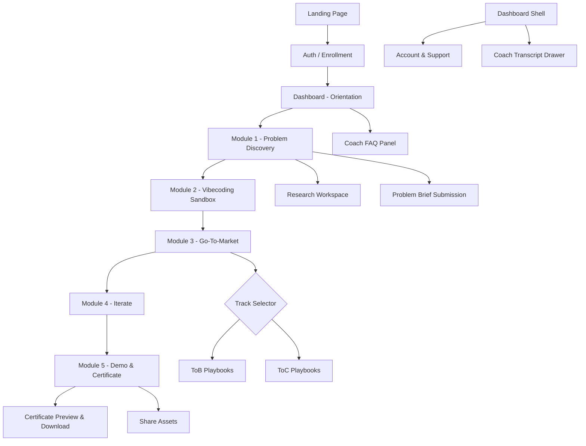
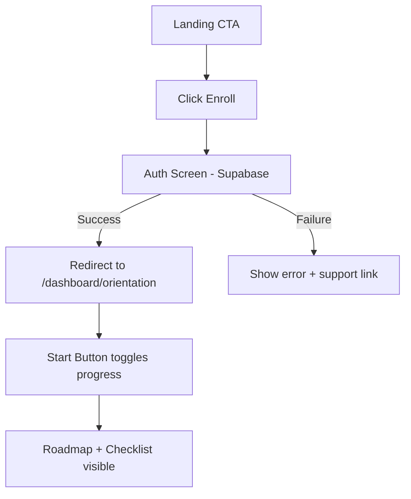
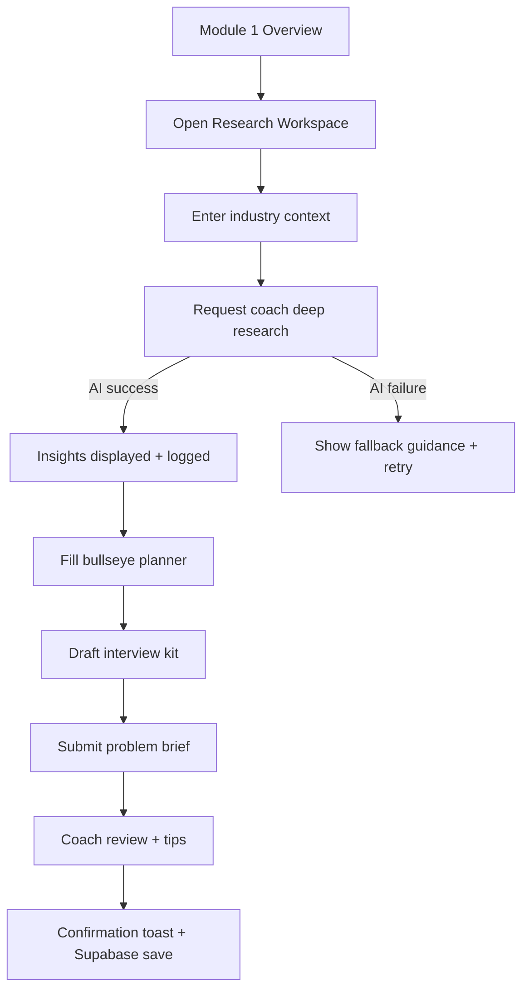
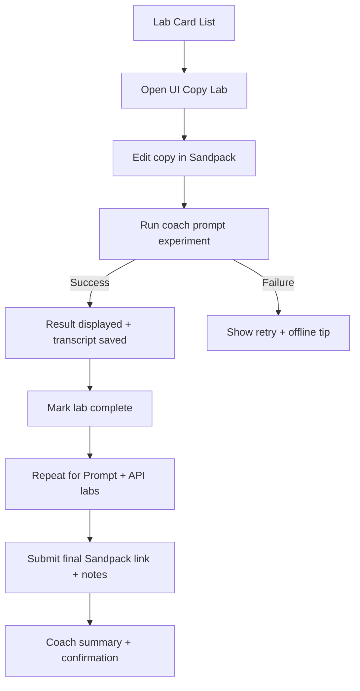
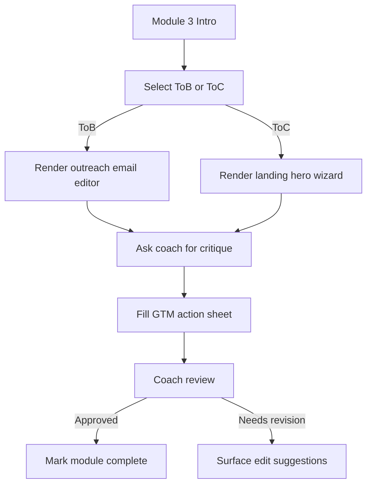
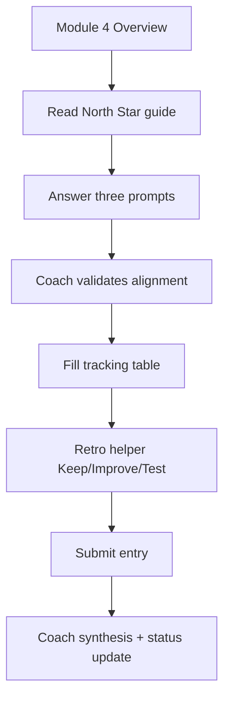
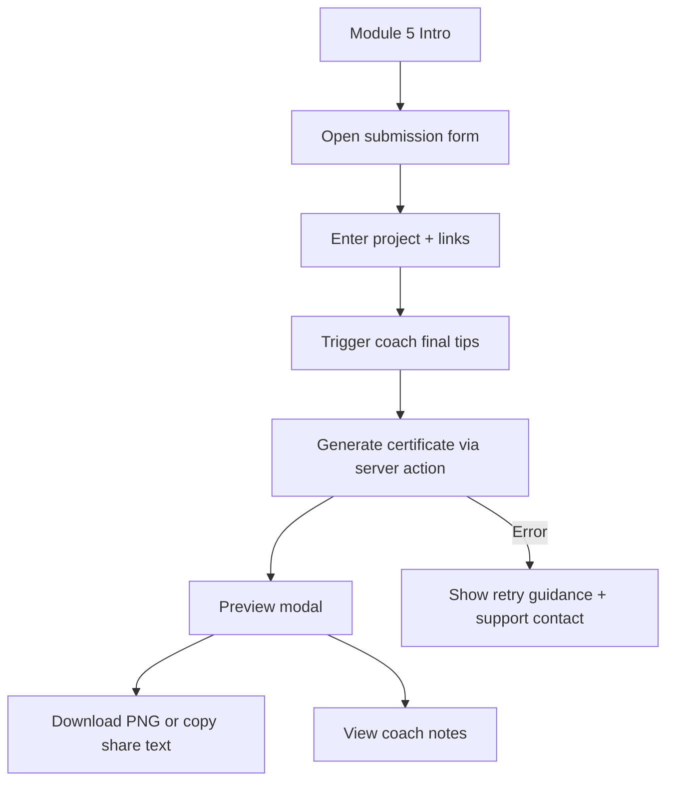

# Interactive AI Startup Course UI/UX Specification

## Introduction
This document defines the user experience goals, information architecture, user flows, and visual design specifications for the Interactive AI Startup Course interface. It establishes a shared reference for design and engineering so the team can deliver a cohesive, learner-centered product that matches the MVP scope described in the PRD.

### Overall UX Goals & Principles

#### Target User Personas
- **Persona A - Ambitious Analyst:** Early-career product thinker who already understands startup frameworks but needs guided practice, clear progress markers, and fast feedback while working through each module.
- **Persona B - Pivoting Professional:** Experienced operator from a non-tech field who requires step-by-step scaffolding, accessible language, and reassurance that every task ties directly to launching their MVP.
- **Persona C - Course Facilitator (Internal):** Limited day-to-day involvement but needs visibility into learner status and minimal triage time when issues surface (future admin view).

#### Usability Goals
- Learners complete account setup and reach Module 1 within 3 minutes of landing on the first dashboard.
- 90 percent of learners understand the overall course roadmap after Orientation (mirrors PRD success metric).
- Module tasks feel bite-sized: each primary action stays under five form fields or a single Sandpack interaction.
- Coach responses load in under 8 seconds and visibly record in the interface to build trust in AI feedback.
- Submission confirmations clearly state what was stored in Supabase and what the learner should do next.

#### Design Principles
1. **Guided momentum** - Every screen should explain the next step and reinforce course progress.
2. **Visible coach partnership** - Treat the AI mentor as a co-pilot with friendly but accountable tone and transparent logging.
3. **Low-friction experimentation** - Learners should feel safe to try, reset, and iterate without losing work.
4. **Clarity over cleverness** - Use plain language, progressive disclosure, and consistent layouts to reduce cognitive load.
5. **Accessible by default** - Meet WCAG 2.1 AA so both personas (including those new to tech) can navigate comfortably.

### Change Log
| Date | Version | Description | Author |
| --- | --- | --- | --- |
| 2025-10-08 | 0.1 | Initial draft covering MVP IA, flows, and visual guidance | Sally (UX Expert) |

## Information Architecture (IA)


```

**Primary Navigation:** Persistent dashboard sidebar with Orientation, Problem Discovery, Vibecoding, Go-To-Market, Iterate, Demo & Certificate, plus Settings/Support. Marketing pages rely on top-level CTA to enroll.

**Secondary Navigation:** Per-module tabs or jump links for sub-sections (e.g., Labs tabs in Module 2, ToB/ToC toggle in Module 3). Coach transcript drawer accessible from a floating button.

**Breadcrumb Strategy:** Dashboard routes do not require traditional breadcrumbs; instead surface a progress pill showing Module X of 6 and contextual sub-step labels. Marketing site can use simple headline anchors (no deep hierarchy yet).

## User Flows

### Flow 1: Enroll and Reach Orientation
- **Goal:** Convert a curious visitor into an authenticated learner who starts Module 0.
- **Success Criteria:** Learner lands on Orientation dashboard with checklist available and progress set to "started" in Supabase.
- **Edge Cases:** Auth failure, returning users already in progress, user closes tab before redirect.



### Flow 2: Module 1 Problem Discovery Workspace
- **Goal:** Help learners run research, log findings, and submit a problem brief with AI coach review.
- **Success Criteria:** Research inputs saved, coach response delivered, problem brief submitted with coach approval status.
- **Edge Cases:** AI timeout, learner saves draft without coach, user jumps to next module prematurely.



### Flow 3: Module 2 Vibecoding Sandbox Labs
- **Goal:** Guide learners through three Sandpack labs with live AI-assisted prompt experimentation.
- **Success Criteria:** Each lab marked complete, prompt experiment result shown, submission saved with notes and Sandpack link.
- **Edge Cases:** Sandpack load failure, API quota exceeded, learner resets project mid-lab.



### Flow 4: Module 3 Go-To-Market Track Selection
- **Goal:** Let learners choose ToB or ToC path, craft assets, and capture an actionable GTM sheet with coach validation.
- **Success Criteria:** Track chosen, required editors completed, coach feedback received, submission stored as approved or needs revision.
- **Edge Cases:** Learner switches tracks mid-way, AI review timed out, missing critical fields.



### Flow 5: Module 4 Iterate Metrics & Retro
- **Goal:** Capture North Star definition, input metrics, and retro notes with coach synthesis.
- **Success Criteria:** North Star prompts completed, tracking table saved, coach highlights shown, module flagged complete.
- **Edge Cases:** Learner lacks metrics, coach result delayed, multi-week entries.



### Flow 6: Module 5 Demo Submission & Certificate
- **Goal:** Collect final project details, generate certificate assets, and encourage sharing.
- **Success Criteria:** Submission stored, certificate preview rendered, download + share copy available, coach tips displayed.
- **Edge Cases:** File generation failure, invalid URLs, learner edits after submission.



## Layout & Page Templates

### Dashboard Shell
- Left sidebar with module navigation, course logo, progress indicator, and Settings/Support links pinned to bottom.
- Top header shows learner name, coach access button, and contextual help icon.
- Main content uses single-column max width 960px with optional right rail for coach transcript drawer on desktop.

### Module Page Template
1. **Context strip:** Module title, short goal statement, progress pill, estimated time.
2. **Checklist cards:** For Orientation, show setup tasks with toggles; for other modules, display step cards that expand.
3. **Primary workspace:** Forms, Sandpack embed, or editors depending on module.
4. **Coach pane:** Collapsible drawer on the right (desktop) or bottom sheet (mobile) showing latest AI responses and a "Ask Coach" form.
5. **Submission footer:** Sticky, with Save/Submit buttons, status badge, and link to help.

### Landing Page Template
- Hero panel with headline, course promise, credential preview, single CTA.
- Modules overview grid (six cards) linking to anchored sections with imagery.
- Proof block with certificate thumbnails and testimonials.
- Pricing section with bullet benefits and CTA.
- FAQ accordion and final CTA bar.

## Component Inventory
| Component | Purpose | Key States |
| --- | --- | --- |
| Module progress pill | Shows learner position (e.g., Module 3 of 6) | default, completed, locked |
| Step checklist card | Orient tasks within module | active, completed, blocked |
| Coach response message | Display AI feedback with metadata | loading, success, error |
| Ask Coach form | Collect learner prompt with context tags | idle, sending, throttled |
| Sandpack lab card | Entry point for labs | default, in-progress, done |
| Track toggle (ToB/ToC) | Switch GTM content | ToB selected, ToC selected |
| Submission confirmation toast | Reinforce saved state | success, warning, error |
| Certificate preview modal | Show generated asset | loading, ready, retry |

## Content Style & Voice
- Use encouraging, action-oriented language that stresses momentum ("Ship your prompt", "Capture your insight").
- Avoid jargon unless introduced via tooltip or coach help; provide real examples drawn from startup scenarios.
- Reinforce accountability by summarizing what the learner just completed and what is next.
- Coach messages should lead with acknowledgement, then actionable critique, ideally three bullets or less.
- Copy should highlight that AI responses are recorded and can be revisited via transcript drawer.

## Visual Design System

### Color Palette
| Token | Hex | Usage |
| --- | --- | --- |
| Primary Blue | #1A5CFF | CTAs, primary links, progress emphasis |
| Deep Navy | #0E1B3D | Headers, sidebar background |
| Support Teal | #1BC5AE | Success states, coach confirmation highlights |
| Alert Amber | #FFB347 | Warnings, needs revision badges |
| Neutral Slate 900 | #111827 | Body text |
| Neutral Slate 200 | #E5E7EB | Dividers, card borders |
| Background Off White | #F7F9FC | Dashboard background |

### Typography
| Style | Size | Weight | Line Height |
| --- | --- | --- | --- |
| H1 | 32px | 700 | 40px |
| H2 | 24px | 600 | 32px |
| H3 | 20px | 600 | 28px |
| Body | 16px | 400 | 24px |
| Small | 14px | 500 | 20px |
- Font stack: "Inter", "Helvetica Neue", Arial, sans-serif.
- Use uppercase for small labels (tracking tokens) sparingly; maintain sentence case elsewhere.

### Iconography
- Icon library: Remix Icon or Heroicons outline set for consistency with Tailwind/Next.js stack.
- Usage guidelines: keep icons 20px for inline text, 24px for buttons; pair with text labels; avoid decorative-only icons in critical flows.

### Spacing & Layout
- Grid system: 12-column responsive grid with 80px gutters on desktop, 24px on mobile.
- Spacing scale: 4px base unit (4, 8, 12, 16, 20, 24, 32, 40, 48, 64).
- Maintain generous whitespace around Sandpack embed to reduce cognitive load; ensure min 64px separation between major sections.

## Accessibility Requirements
**Standard:** WCAG 2.1 AA

**Visual:**
- Color contrast ratios: minimum 4.5:1 for text, 3:1 for large headings and graphical elements.
- Focus indicators: 2px visible focus ring using Support Teal.
- Text sizing: support zoom to 200 percent without loss of functionality.

**Interaction:**
- Keyboard navigation: All interactive elements reachable in logical order; trap focus inside modals with Esc to close.
- Screen reader support: Provide descriptive aria-live regions for coach responses; label toggles and lab cards with status.
- Touch targets: Minimum 44x44px for buttons and list items.

**Content:**
- Alternative text: Provide concise alt text for certificate thumbnails, testimonials, and icons conveying meaning.
- Heading structure: One H1 per page; use descending hierarchy without skipping levels.
- Form labels: Persistently visible labels with helper text for examples; error messages tied via aria-describedby.

**Testing Strategy:**
- Run automated checks (axe DevTools) on key templates each sprint.
- Manual keyboard walkthrough for each module flow before release.
- Spot-check screen reader experience with NVDA (Windows) and VoiceOver (Mac) for Orientation and one module per release.

## Responsiveness Strategy

| Breakpoint | Min Width | Max Width | Target Devices |
| --- | --- | --- | --- |
| Mobile | 320px | 639px | Phones, small tablets portrait |
| Tablet | 640px | 1023px | Medium tablets, small laptops |
| Desktop | 1024px | 1439px | Laptops, standard monitors |
| Wide | 1440px | - | Large monitors, presentation displays |

**Layout Changes:** Collapse sidebar into top app bar on mobile; convert step checklists into accordion stack.

**Navigation Changes:** Replace persistent sidebar with hamburger menu on mobile; keep quick-jump FAB for module navigation.

**Content Priority:** Keep context strip and coach button visible without scroll; defer transcripts to separate screen on mobile if needed.

**Interaction Changes:** Use bottom sheet for "Ask Coach" on mobile; ensure Sandpack preview switches to stacked code/preview view.

## Animation & Micro-interactions
- Motion principles: subtle, purposeful, under 200ms; prefer fade/slide for context, not flourish.
- Coach response card fades in with slight upward motion to signal new content.
- Progress pill uses animated fill when modules complete (150ms ease-out).
- Checklist toggles animate state change with scale bump (120 percent to 100 percent) to reward completion.
- Modal open/close uses 180ms ease-in-out opacity + scale.

## Performance Considerations
- Page Load: Target under 2.5 seconds on 3G for landing page; under 1.5 seconds for authenticated dashboard using skeleton loaders.
- Interaction Response: Coach responses should show optimistic loading state immediately and resolve within 8 seconds.
- Animation FPS: Maintain 60 fps by avoiding heavy drop shadows; prefer CSS transforms over layout-changing animations.
- Design strategies: Lazy-load Sandpack bundle, keep image assets optimized, avoid background videos, reuse coach transcript data stored client-side where possible.

## Next Steps
1. Review this specification with product, engineering, and content stakeholders for alignment.
2. Translate layouts into Figma with annotated components and responsive variants.
3. Partner with engineering to validate feasibility of Sandpack layout and coach drawer interactions.
4. Conduct quick usability concept test with two representatives from each persona before finalizing visuals.

### Design Handoff Checklist
- [ ] All user flows documented
- [ ] Component inventory complete
- [ ] Accessibility requirements defined
- [ ] Responsive strategy clear
- [ ] Brand guidelines incorporated
- [ ] Performance goals established

## Checklist Results
No formal UX checklist has been run yet; schedule a review once visual mocks are complete.

